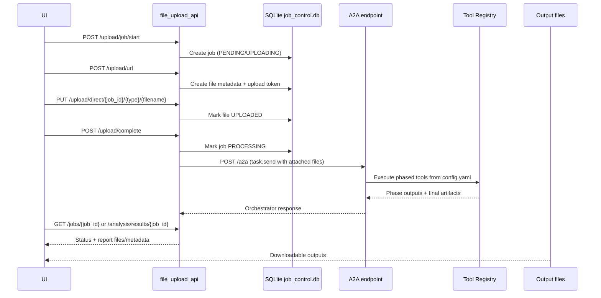

# Mobile Contract Agent — Workflow Guide

This document explains how the **entire `mobile-contract-agent` folder** works as one system.

---

## 1) Folder-level workflow map

```text
mobile-contract-agent/
├─ src/
│  ├─ a2a_server.py            # Starts A2A server + mounts extra REST APIs
│  ├─ file_upload_api.py       # Upload/job orchestration endpoints
│  └─ tools/                   # Business tools used by phased orchestration
├─ configs/config.yaml         # Phases, tools, model, orchestration rules
├─ .agenticai.yaml             # Local runtime defaults (port, entry, env)
├─ Dockerfile                  # Container workflow
├─ cli/                        # Infra/docker helper CLI commands
└─ terraform/                  # Azure infrastructure definitions
```

---

## 2) Runtime workflow (what happens when service starts)

```mermaid
flowchart TD
    A[Run agenticai dev . or agenticai run .] --> B[src/__main__.py]
    B --> C[src/a2a_server.py main()]
    C --> D[A2AFactory creates server]
    C --> E[Import src/tools/__init__.py to register tools]
    C --> F[create_upload_api mounts upload routes]
    C --> G[Include /databricks router]
    D --> H[server.run on port 8000]
```

### Key points
- Entry point is `src/__main__.py`, which calls `main()` in `src/a2a_server.py`.
- `A2AFactory` builds the core A2A server using `configs/config.yaml`.
- Tool registration happens through imports in `src/tools/__init__.py`.
- `file_upload_api.py` routes are mounted onto the same FastAPI app.
- Databricks helper endpoints are added under `/databricks/*`.

---

## 3) Business workflow (upload → orchestration → reports)

This is the main user flow used by UI/backend integration.



---

## 4) Phased orchestration workflow (from `configs/config.yaml`)

The agent executes **3 configured phases**:

1. **Data Extraction Phase**
   - Tool: `invoice_pdf_to_tables`
   - Input: uploaded PDF file(s)
   - Output: invoice tables and extraction metadata

2. **Employee Data Loading Phase**
   - Tool: `load_databricks_employee_data`
   - Output: `Employee_data` table + mapping stats

3. **Report Generation Phase**
   - Tool: `generate_mobile_contract_reports`
   - Consumes invoice + employee tables
   - Produces analysis outputs (including downloadable files)

### Tool registration source
- Tools are imported and exposed in `src/tools/__init__.py`.
- `load_databricks_employee_data` is implemented in `src/tools/databricks_loader.py`.

---

## 5) Databricks workflow

There are **two Databricks usage paths**:

### A) REST helper endpoints (UI-driven checks)
- `GET /databricks/ping` (server env-token check)
- `POST /databricks/test` (client-provided token)
- `POST /databricks/fetch-employees` (record count fetch)

### B) Orchestrator tool path (phase 2)
- `load_databricks_employee_data`:
  - Connects via `databricks-sql-connector`
  - Reads SIM + user views
  - Normalizes phone numbers
  - Writes `Employee_data` to session SQLite
  - Returns summary used by later phases

---

## 6) Storage/data workflow

### Job + upload metadata
- Database: `job_control.db` (`/app/data/job_control.db`)
- Tables include:
  - `job_tracker`
  - `files_metadata`

### File locations
- Uploads: `/mnt/agentfiles/uploads`
- Working data: `/mnt/agentfiles/data`
- Outputs: `/mnt/agentfiles/output`

### Common status progression
`PENDING` → `PROCESSING` → (`COMPLETED` or `FAILED`)

---

## 7) Developer workflow (when you change code)

1. Edit code under `src/` or `configs/config.yaml`.
2. Run local dev server:
   - `agenticai dev .`
3. Test a flow:
   - Start upload job
   - Upload PDF(s)
   - Complete upload (triggers orchestrator)
4. Validate outputs using:
   - `/jobs/{job_id}`
   - `/analysis/results/{job_id}`
   - `/download/output/...`

---

## 8) Deployment workflow

### Container workflow
1. Build image (`Dockerfile`): `agenticai build .`
2. Run container: `agenticai run . --mode docker`

### Infra workflow
- Use CLI under `cli/` (infra/iac commands) or Terraform directly in `terraform/`.
- Environment-specific configs are in:
  - `terraform/environments/test`
  - `terraform/environments/staging`
  - `terraform/environments/prod`

---

## 9) Quick trace checklist (fresher-friendly)

When something fails, check this order:

1. Service started from `src/a2a_server.py` on port `8000`.
2. Env vars loaded from `.env.development`.
3. Upload file status reached `UPLOADED`.
4. `/upload/complete` triggered orchestrator.
5. A2A task reached all 3 phases.
6. Databricks token/host/path are valid (if using Databricks path).
7. Output files exist under `/mnt/agentfiles/output`.
